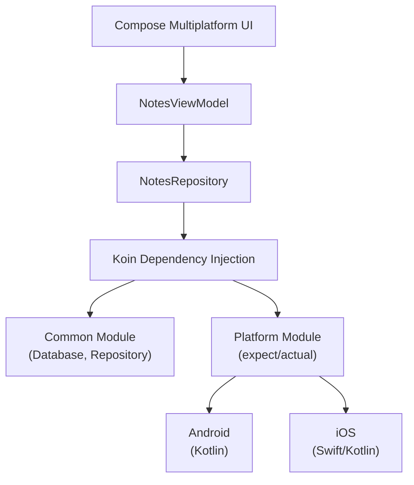

# 📱 Notes App V3 - Tugas Praktikum 8

Aplikasi pencatatan (Notes App) modern yang dibangun menggunakan **Kotlin Multiplatform (KMP)**. Project ini difokuskan pada implementasi fitur spesifik platform (Android & iOS) menggunakan pola `expect/actual` dan Dependency Injection dengan Koin.

---

## 👨‍💻 Identitas Mahasiswa

* **Nama:** Gian Ivander
* **NIM:** 123140040
* **Kelas:** Pengembangan Aplikasi Mobile RA 

---

## 📊 Komposisi Bahasa Pemrograman

* **Kotlin:** 97.6% (Shared Logic & Platform Implementations)
* **Swift:** 2.4% (iOS Native Interop)

---

## 🎯 Tujuan Proyek

Proyek ini mendemonstrasikan:
- Penggunaan Kotlin Multiplatform untuk berbagi kode antar platform
- Pattern `expect/actual` untuk akses API native
- Dependency Injection menggunakan Koin
- Reactive programming dengan Kotlin Coroutines dan Flow
- Clean Architecture di aplikasi mobile

---

## 🚀 Fitur yang Diimplementasikan (Week 8)

### 💉 Dependency Injection (Koin)
Manajemen dependensi yang efisien di seluruh platform target:
* **Database & Repository**: Diinjeksi secara otomatis ke ViewModel.
* **Platform Services**: Injeksi `DeviceInfo` dan `NetworkMonitor` menggunakan modul spesifik platform.
* **Testability**: Memudahkan unit testing dengan mock dependencies.

### 🧠 expect/actual Implementation
Mengakses API native sambil tetap mempertahankan satu codebase di `commonMain`:
* **DeviceInfo**: Mengambil nama perangkat, manufacturer, dan versi OS.
* **Real-time Battery Tracking**: Memantau level baterai dan status pengisian daya (Charging/Not Charging) secara reaktif.
* **NetworkMonitor**: Mendeteksi status koneksi internet menggunakan listener native.

### 📡 Network Status Indicator
* **Reactive UI**: Menggunakan Kotlin Coroutines `Flow` untuk mengamati perubahan koneksi.
* **Smart Notifications**: 
    * 🔴 Bar merah muncul saat perangkat **Offline**.
    * 🟢 Notifikasi hijau "Back Online" muncul selama 3 detik saat koneksi kembali.

### ⚙️ Enhanced Settings Screen
* **Device Info Display**: Bagian khusus di layar Settings untuk melihat detail perangkat dan status baterai secara live.
* **Real-time Updates**: Informasi baterai dan jaringan diperbarui secara otomatis.

---

## 🏗️ Architecture Overview

Aplikasi mengikuti pola clean architecture di mana layer UI mengamati state dari ViewModel, yang berinteraksi dengan API platform melalui abstraksi yang dibagikan.



---

## 💉 Koin Dependency Injection

Koin digunakan untuk mempermudah pengujian dan pemisahan logika platform. Modul disusun menjadi:

### CommonModule
```
- DatabaseFactory
- NotesRepository
- NotesViewModel
```

### PlatformModule (Android)
```
- DatabaseDriverFactory (Android)
- DeviceInfo (menggunakan android.os.Build)
- NetworkMonitor (menggunakan ConnectivityManager)
- BatteryMonitor
```

### PlatformModule (iOS)
```
- DatabaseDriverFactory (iOS)
- DeviceInfo (menggunakan UIDevice)
- NetworkMonitor (menggunakan NWPathMonitor)
- BatteryMonitor
```

---

## 🧠 Platform-Specific Features

### expect/actual Pattern
Saya mendefinisikan "apa" (kontrak) di `commonMain` dan "bagaimana" (implementasi) di modul platform:

1. **DeviceInfo**
   - Android: Menghubungkan ke `android.os.Build` untuk mendapatkan informasi perangkat
   - iOS: Menggunakan `UIDevice` untuk akses informasi perangkat native

2. **NetworkMonitor**
   - Android: Menggunakan `ConnectivityManager` untuk mendeteksi perubahan koneksi
   - iOS: Menggunakan `NWPathMonitor` untuk monitoring koneksi real-time

3. **Battery Status**
   - Diimplementasikan sebagai `Flow` untuk memberikan pembaruan real-time ke UI
   - Memungkinkan UI untuk react terhadap perubahan status baterai tanpa perlu refresh halaman

---

## 📸 Screenshots

|       Device Info (Settings)        |           Network Offline           |            Back Online            |
|:-----------------------------------:|:-----------------------------------:|:---------------------------------:|
|  |  |  |

---

## 🎥 Demo Video

https://github.com/user-attachments/assets/0e838d04-7b1c-48e4-9234-0a88300f6553

---

## ⚙️ Setup & Run

### Prerequisites
- Android Studio (Arctic Fox atau lebih baru)
- JDK 11+
- Kotlin 1.9+

### Steps
1. **Clone repository**:
   ```bash
   git clone https://github.com/15-040-GianIvander/9_123140040.git
   cd 9_123140040
   ```

2. **Buka project di Android Studio**:
   - File → Open → Pilih folder project

3. **Tunggu Gradle Sync selesai**

4. **Jalankan aplikasi**:
   - Pilih target `composeApp`
   - Pilih Android Emulator atau connect Physical Device
   - Klik Run atau tekan Shift + F10

---

## 📚 Tech Stack

| Komponen | Teknologi | Versi |
|----------|-----------|-------|
| Language | Kotlin | 1.9+ |
| Multiplatform | Kotlin Multiplatform (KMP) | Latest |
| UI Framework | Compose Multiplatform | Latest |
| DI Framework | Koin | Latest |
| Database | SQLite (SQLDelight) | Latest |
| Async | Kotlin Coroutines | Latest |
| Platform Target | Android & iOS | - |

---

## 📂 Project Structure

```
9_123140040/
├── composeApp/                    # Shared UI dan platform-specific code
│   ├── src/
│   │   ├── commonMain/           # Shared Kotlin code
│   │   │   ├── kotlin/
│   │   │   │   ├── ui/          # Compose UI Components
│   │   │   │   ├── viewmodel/   # ViewModels
│   │   │   │   ├── repository/  # Repository Pattern
│   │   │   │   ├── database/    # Database Layer
│   │   │   │   └── platform/    # expect definitions
│   │   │   └── resources/
│   │   ├── androidMain/          # Android-specific implementations
│   │   │   └── kotlin/
│   │   │       └── platform/    # actual implementations
│   │   └── iosMain/              # iOS-specific implementations
│   │       └── kotlin/
│   │           └── platform/    # actual implementations
│   └── build.gradle.kts
├── iosApp/                        # iOS App Wrapper
├── gradle/
├── build.gradle.kts
├── settings.gradle.kts
└── README.md
```

---

## 🔄 Development Workflow

### Menambah Fitur Baru
1. Definisikan interface di `commonMain/platform/`
2. Implementasikan di `androidMain/platform/` dan `iosMain/platform/`
3. Gunakan melalui Koin DI di ViewModel
4. Bind ke UI menggunakan Compose

### Testing
- Unit test untuk business logic di `commonTest/`
- Mock dependencies menggunakan Koin test module
- Test platform-specific behavior di `androidTest/` dan `iosTest/`

---

## 🛠️ Troubleshooting

### Gradle Sync Error
- Bersihkan: `./gradlew clean`
- Rebuild: `./gradlew build`
- Invalidate Cache: File → Invalidate Caches → Restart

### Build Error untuk iOS
- Pastikan memiliki Xcode 14+
- Run `pod install` di folder `iosApp/`

### Network Monitor tidak berfungsi
- Pastikan permission sudah ditambahkan di AndroidManifest.xml:
  ```xml
  <uses-permission android:name="android.permission.ACCESS_NETWORK_STATE" />
  ```

---

## 📝 Catatan Penting

- Proyek ini adalah bagian dari Tugas Praktikum 8 untuk kelas Pengembangan Aplikasi Mobile RA
- Fokus implementasi adalah pada pemahaman deep tentang Kotlin Multiplatform Architecture dan platform-specific features
- Semua platform-specific logic diabstraksi menggunakan pattern expect/actual
- DI pattern (Koin) memudahkan testing dan maintenance

---

## 📚 Referensi & Resources

- [Kotlin Multiplatform Documentation](https://kotlinlang.org/docs/multiplatform.html)
- [Compose Multiplatform](https://www.jetbrains.com/help/kotlin-multiplatform-mobile/)
- [Koin Dependency Injection](https://insert-koin.io/)
- [Kotlin Coroutines](https://kotlinlang.org/docs/coroutines-overview.html)
- [SQLDelight](https://cashapp.github.io/sqldelight/)

---

## 📞 Kontak

**Gian Ivander** - NIM: 123140040  
GitHub: [@15-040-GianIvander](https://github.com/15-040-GianIvander)  
Repository: [9_123140040](https://github.com/15-040-GianIvander/9_123140040)

---

## 📄 License

Project ini tersedia di bawah lisensi yang ditentukan di repository. Silakan lihat file LICENSE untuk detail lengkap.

**Status:** ✅ Active & Maintained
