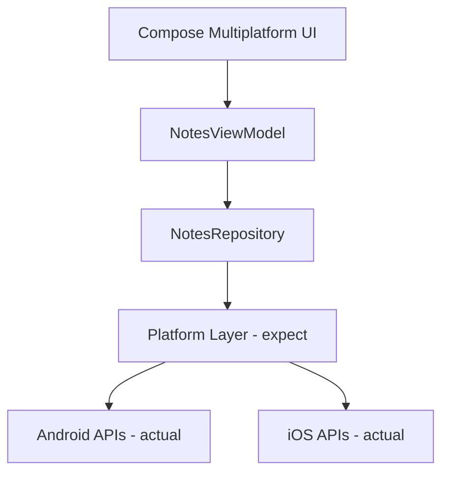

# 📱 Notes App V3 - Tugas Praktikum 8

Aplikasi pencatatan (Notes App) modern yang dibangun menggunakan **Kotlin Multiplatform (KMP)**. Project ini difokuskan pada implementasi fitur spesifik platform (Android & iOS) menggunakan pola `expect/actual` dan manajemen dependensi menggunakan **Koin**.

---

## 👨‍💻 Identitas Mahasiswa

* **Nama:** Gian Ivander
* **NIM:** 123140040
* **Kelas:** Pengembangan Aplikasi Mobile RA 

---

## 🚀 Fitur yang Diimplementasikan (Week 8)

### 💉 Dependency Injection (Koin)
Manajemen dependensi yang efisien di seluruh platform target:
* **Database & Repository**: Diinjeksi secara otomatis ke ViewModel.
* **Platform Services**: Injeksi `DeviceInfo` dan `NetworkMonitor` menggunakan modul spesifik platform.

### 🧠 expect/actual Implementation
Mengakses API native sambil tetap mempertahankan satu codebase di `commonMain`:
* **DeviceInfo**: Mengambil nama perangkat, manufacturer, dan versi OS.
* **Real-time Battery Tracking**: Memantau level baterai dan status pengisian daya (Charging/Not Charging) secara reaktif.
* **NetworkMonitor**: Mendeteksi status koneksi internet menggunakan listener native.

### 📡 Network Status Indicator
* **Reactive UI**: Menggunakan Kotlin Coroutines `Flow` untuk mengamati perubahan koneksi.
* **Smart Notifications**: 
    * 🔴 Bar merah muncul saat perangkat **Offline**.
    * 🟢 Notifikasi hijau "Back Online" muncul selama 3 detik saat koneksi kembali.

### ⚙️ Enhanced Settings Screen
* **Device Info Display**: Bagian khusus di layar Settings untuk melihat detail perangkat dan status baterai secara live.

---

## 🏗️ Architecture Overview

Aplikasi mengikuti pola clean architecture di mana layer UI mengamati state dari ViewModel, yang berinteraksi dengan API platform melalui abstraksi yang dibagikan.



---

## 💉 Koin Dependency Injection

Koin digunakan untuk mempermudah pengujian dan pemisahan logika platform. Modul disusun menjadi:
* **commonModule**: Berisi definisi Database, Repository, dan ViewModel.
* **platformModule**: Berisi implementasi spesifik seperti `DatabaseDriverFactory`, `DeviceInfo`, dan `NetworkMonitor`.

---

## 🧠 Platform-Specific Features

### expect/actual Pattern
Saya mendefinisikan "apa" (kontrak) di `commonMain` dan "bagaimana" (implementasi) di modul platform:
1. **DeviceInfo**: Menghubungkan ke `android.os.Build` di Android dan `UIDevice` di iOS.
2. **NetworkMonitor**: Menggunakan `ConnectivityManager` (Android) dan `NWPathMonitor` (iOS).
3. **Battery Status**: Diimplementasikan sebagai `Flow` untuk memberikan pembaruan real-time ke UI tanpa refresh halaman.

---

## 📸 Screenshots

|       Device Info (Settings)        |           Network Offline           |            Back Online            |
|:-----------------------------------:|:-----------------------------------:|:---------------------------------:|
|  |  |  |

---

## 🎥 Demo Video

https://github.com/user-attachments/assets/0e838d04-7b1c-48e4-9234-0a88300f6553

---

## ⚙️ Setup & Run

1. **Clone repository**:
   ```bash
   git clone https://github.com/15-040-GianIvander/9_123140040.git
   ```
2. Buka project di **Android Studio**.
3. Tunggu Gradle Sync selesai.
4. Pilih target `composeApp` dan jalankan pada **Android Emulator/Device**.

---

## 📚 Tech Stack

* **Kotlin Multiplatform (KMP)**: Shared codebase untuk Android & iOS
* **Compose Multiplatform**: UI framework yang konsisten di semua platform
* **Koin**: Dependency Injection Framework
* **SQLite**: Database lokal (via SQLDelight)
* **Kotlin Coroutines**: Asynchronous programming & reactive updates

---

## 📝 Notes

Proyek ini adalah bagian dari Tugas Praktikum 8 untuk kelas Pengembangan Aplikasi Mobile. Fokus implementasi adalah pada pemahaman deep tentang Kotlin Multiplatform Architecture dan platform-specific feature integration menggunakan pola `expect/actual`.
