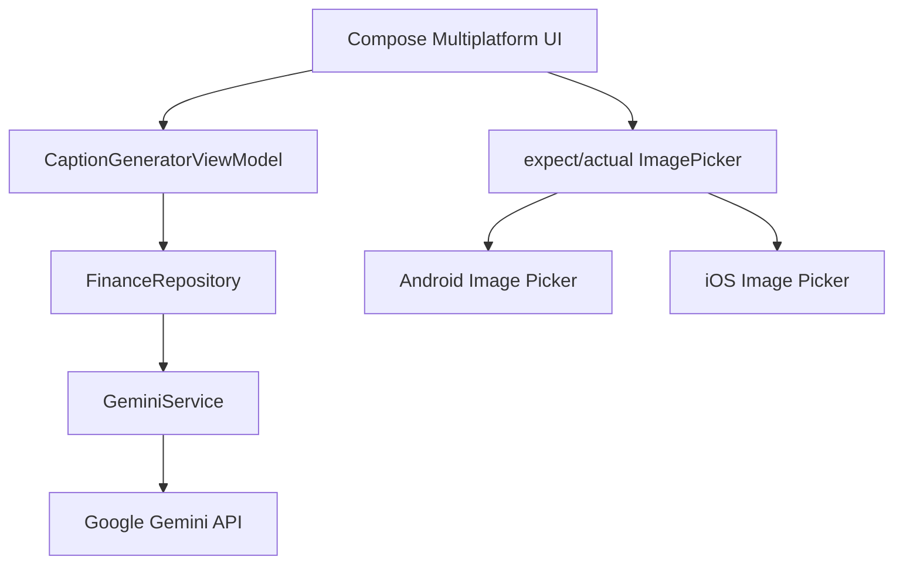

# 📱 CaptionGenerator - AI-Powered Social Media Caption Generator

Aplikasi generator caption media sosial cerdas yang dibangun menggunakan **Kotlin Multiplatform (KMP)**. Project ini memanfaatkan Google Gemini API untuk menghasilkan caption menarik dengan integrasi gambar opsional.

---

## 👨‍💻 Identitas Mahasiswa

* **Nama:** Gian Ivander
* **NIM:** 123140040
* **Kelas:** Pengembangan Aplikasi Mobile RA

---

## 📊 Komposisi Bahasa Pemrograman

* **Kotlin:** 97.6% (Shared Logic & Platform Implementations)
* **Swift:** 2.4% (iOS Native Interop)

---

## 🎯 Tujuan Proyek

Proyek ini mendemonstrasikan:
- Integrasi AI (Google Gemini API) dalam aplikasi mobile
- Kotlin Multiplatform untuk berbagi kode antar platform
- Pattern `expect/actual` untuk akses API native
- Reactive programming dengan Kotlin Coroutines dan Flow
- Clean Architecture di aplikasi mobile dengan AI integration

---

## 🚀 Fitur yang Diimplementasikan

### 🤖 AI Caption Generation
* **Multi-Variant Captions**: Menghasilkan 3 variasi caption (Funny, Professional, Brief)
* **Image Context**: Dukungan input gambar untuk konteks yang lebih baik
* **Smart Hashtags**: Rekomendasi hashtag otomatis
* **Content Evaluation**: Analisis konten dari AI

### 🖼️ Image Integration
* **Platform-Specific Image Picker**: Menggunakan expect/actual pattern untuk akses galeri
* **Base64 Encoding**: Konversi gambar untuk API Gemini
* **Optional Input**: Caption bisa dihasilkan dengan atau tanpa gambar

### 📡 Gemini API Integration
* **Real-time Processing**: Komunikasi langsung dengan Google Gemini API
* **Error Handling**: Penanganan error untuk API key invalid dan koneksi gagal
* **Timeout Management**: 60 detik timeout untuk response
* **Structured Response**: Parsing JSON response ke model data terstruktur

### ⚙️ Enhanced UI/UX
* **Compose Multiplatform**: UI yang konsisten di Android dan iOS
* **State Management**: Reactive UI dengan StateFlow
* **Loading States**: Indikator loading selama pemrosesan AI
* **Error Display**: Pesan error yang informatif

---

## 🏗️ Architecture Overview

Aplikasi mengikuti pola clean architecture dengan integrasi AI:



---

## 🧠 Platform-Specific Features

### expect/actual Pattern
Mengakses API native untuk image picker:

1. **ImagePicker**
   - Android: Menggunakan `ActivityResultContracts.GetContent()`
   - iOS: Menggunakan platform-specific image selection

2. **HTTP Client**
   - Android: OkHttp engine
   - iOS: iOSHttp engine

---

## 📸 Screenshots

|       Main Screen        |           With Image Input           |            Generated Captions            |
|:------------------------:|:-----------------------------------:|:----------------------------------------:|
| | |  |

---

## 🎥 Demo Video

https://github.com/user-attachments/assets/b5e0c7da-c131-4d77-9f31-0c15c40480e2

---

## ⚙️ Setup & Run

### Prerequisites
- Android Studio (Arctic Fox atau lebih baru)
- JDK 11+
- Kotlin 2.3+
- Google Gemini API Key

### Steps
1. **Clone repository**:
   ```bash
   git clone https://github.com/15-040-GianIvander/caption-generator.git
   cd caption-generator
   ```

2. **Setup API Key**:
   - Dapatkan API key dari [Google AI Studio](https://makersuite.google.com/app/apikey)
   - Untuk Android: Tambahkan ke `local.properties`:
     ```
     GEMINI_API_KEY=your_api_key_here
     ```
   - Untuk iOS: Tambahkan ke Xcode build settings

3. **Buka project di Android Studio**:
   - File → Open → Pilih folder project

4. **Tunggu Gradle Sync selesai**

5. **Jalankan aplikasi**:
   - Pilih target `composeApp`
   - Pilih Android Emulator atau connect Physical Device
   - Klik Run atau tekan Shift + F10

---

## 📚 Tech Stack

| Komponen | Teknologi | Versi |
|----------|-----------|-------|
| Language | Kotlin | 2.3+ |
| Multiplatform | Kotlin Multiplatform (KMP) | Latest |
| UI Framework | Compose Multiplatform | 1.10.3 |
| AI API | Google Gemini | gemini-2.5-flash-lite |
| HTTP Client | Ktor | 2.3.12 |
| Serialization | Kotlinx Serialization | 1.6.3 |
| Async | Kotlin Coroutines | Latest |
| Platform Target | Android & iOS | - |

---

## 📂 Project Structure

```
CaptionGenerator/
├── composeApp/                    # Shared UI dan platform-specific code
│   ├── src/
│   │   ├── commonMain/           # Shared Kotlin code
│   │   │   ├── kotlin/
│   │   │   │   ├── ui/          # Compose UI Components
│   │   │   │   ├── presentation/ # ViewModels & UI State
│   │   │   │   ├── data/        # Repository & API Layer
│   │   │   │   └── utils/       # Utilities (ImagePicker)
│   │   │   └── resources/
│   │   ├── androidMain/          # Android-specific implementations
│   │   │   └── kotlin/
│   │   │       └── com/gianivander/captiongenerator/
│   │   └── iosMain/              # iOS-specific implementations
│   │       └── kotlin/
│   │           └── com/gianivander/captiongenerator/
│   └── build.gradle.kts
├── iosApp/                        # iOS App Wrapper
├── gradle/
├── build.gradle.kts
├── settings.gradle.kts
└── README.md
```

---

## 🔄 Development Workflow

### Menambah Fitur Baru
1. Definisikan interface di `commonMain/utils/`
2. Implementasikan di `androidMain/` dan `iosMain/`
3. Gunakan di ViewModel untuk state management
4. Bind ke UI menggunakan Compose

### Testing
- Unit test untuk business logic di `commonTest/`
- Mock API responses untuk testing
- Test platform-specific behavior di `androidTest/` dan `iosTest/`

---

## 🛠️ Troubleshooting

### Gradle Sync Error
- Bersihkan: `./gradlew clean`
- Rebuild: `./gradlew build`
- Invalidate Cache: File → Invalidate Caches → Restart

### Build Error untuk iOS
- Pastikan memiliki Xcode 14+
- Run `pod install` di folder `iosApp/`

### Gemini API Error
- Pastikan API key valid dan memiliki quota
- Check network connectivity
- Verify API key configuration in build settings

---

## 📝 Catatan Penting

- Proyek ini mendemonstrasikan integrasi AI dalam aplikasi mobile KMP
- Fokus pada real-world AI integration dengan clean architecture
- Semua platform-specific logic diabstraksi menggunakan pattern expect/actual
- Menggunakan production-ready practices untuk API integration

---

## 📚 Referensi & Resources

- [Kotlin Multiplatform Documentation](https://kotlinlang.org/docs/multiplatform.html)
- [Compose Multiplatform](https://www.jetbrains.com/help/kotlin-multiplatform-mobile/)
- [Google Gemini API](https://ai.google.dev/docs)
- [Ktor HTTP Client](https://ktor.io/docs/getting-started-ktor-client.html)
- [Kotlin Coroutines](https://kotlinlang.org/docs/coroutines-overview.html)

---

## 📞 Kontak

**Gian Ivander** - NIM: 123140040  
GitHub: [@15-040-GianIvander](https://github.com/15-040-GianIvander)  
Repository: [caption-generator](https://github.com/15-040-GianIvander/caption-generator)

---

## 📄 License

Project ini tersedia di bawah lisensi yang ditentukan di repository. Silakan lihat file LICENSE untuk detail lengkap.

**Status:** ✅ Active & Maintained
